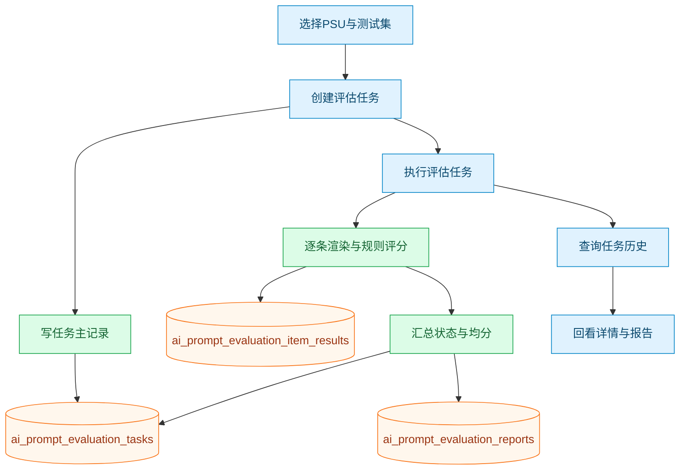
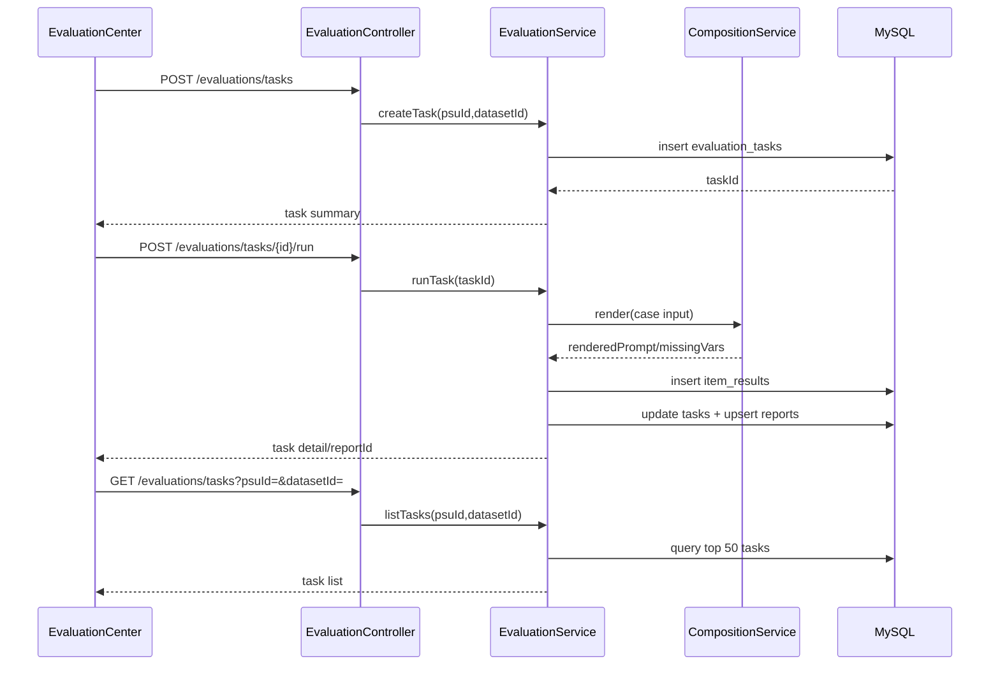
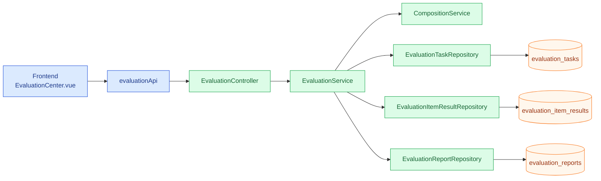

# Prompt服务单元（PSU）全生命周期管理平台 V1.0 正式定稿PRD（全约束对齐版）（版本时间：2026-04-29）

**文档密级**：内部研发涉密 · 禁止对外同步

**文档版本**：V2.1 对齐更新版

**版本时间**：2026年04月29日（本次工作区回顾补充）

**生效日期**：2026年04月10日

**适配技术栈**：
- 前端：Vue 3.4 (Composition API) + Pinia 2.1.7 + Element Plus 2.4.0 + Vue Router 4.2.5 + Axios 1.6.0 + Vite 5.0
- 后端：Java 17 + Spring Boot 3.2.0 + Spring Security + Spring Data JPA + MySQL 8.0 + Redis（预留依赖，当前业务未启用） + JWT (jjwt 0.11.5) + Lombok + SpringDoc OpenAPI 2.2.0 + BCrypt + AES-256

**部署形态**：私有化部署、仅手工/半自动化发布、不依赖平台侧流水线

**核心前置约束（已逐条锁死，开发不可扩范围）**：

1. RBAC权限极简收拢：只保留核心在岗角色，**平台不新增、不配置、不预留任何只读账号/只读权限体系**；

2. 全局系统配置入口强隔离：仅超级管理员可见可操作，全员屏蔽，配置项只保留核心可用API密钥，冗余配置全部砍掉；

3. 代码生成能力定向收敛：只输出各业务服务专属的参数拼装、Prompt组装标准底层业务代码，**不生成任何前后端交互接口、Controller层、网关层关联代码**，生成后由研发人工核验手动引入工程；

4. PSU全域落地核心准则：全流程围绕标准化代码Git入库闭环推进，业务资产、版本、配置全部绑定代码台账，弱化页面兜底能力，不依托前端界面做生产级上线交付；

5. 版本&命名空间轻量化简化：不设计复杂环境隔离命名空间、不做多层灰度版本链路，固定上线闭环：产品/运营双人在线验收实测 → 确认锁定可用版本 → 研发介入合规复测 + 批量生成标准业务代码 → 强制Git合规落库登记 → 研发侧自主完成服务打包上线，全程平台仅做流程串联，不接管发布权限；

6. 零流水线设计：平台内部不搭建、不对接、不联动任何CI/CD流水线，无流水线配置面板、无流水线日志、无流水线触发按钮；

7. 生态能力清零：不开发、不接入、不兼容任何第三方插件市场、自定义插件、拓展插件能力；

8. 强结构权限刚性管控：JSON入参/出参Schema**仅研发账号可编辑、可新增、可修改、可下线**；产品、运营、业务岗全程只读，仅可查看结构台账、拖拽编排Prompt、定点填入业务变量，无任何Schema修改权限入口。

## 一、修订追溯台账（合规归档）

|版本号|修订时间|逐条修订内容|责任归属|
|---|---|---|---|
|V0.1|2026.04.10|初稿搭建，完成双空间架构、PSU核心模型、基础流程底座搭建|产品部|
|V0.2|2026.04.10|第一轮刚性删减：剔除Python、删减运维模块、关停流水线、取消一键部署、收拢RBAC权限|产研同步对齐|
|V1.0 终版|2026.04.10|第二轮权限强控定稿：锁定JSON Schema研发专属编辑权，业务侧仅只读编排；同步固化半自动化发布、代码入库全流程，全约束闭环定稿|产研终审签字|
|V1.1 对齐版|2026.04.15|第三轮设计稿对齐：补充完整技术栈明细（Vue3.4/Pinia/Element Plus/Spring Boot 3.2/MySQL 8.0/Redis/JWT）、对齐数据库表结构（ai_prompt_*前缀、新增test_datasets）、补充完整API接口设计（9大模块）、补充前端架构设计、补充安全设计（JWT/BCrypt/AES-256/LLM集成）、修正Prompt定版逻辑（业务角色finalize）|产研终审签字|
|V1.2 时间标记版|2026.04.29|补充文档标题与版本时间标记，便于版本追溯与跨文档对齐|研发对齐更新|
|V1.3 开发同步版|2026.04.29|同步近期落地能力：Prompt测试统一后端接口、测试运行历史查询、审核预览回传参数集快照、Git提交hash登记校验与页面入口|研发对齐更新|
|V1.4 测试链路增强版|2026.04.29|测试运行补充状态与异常原因字段（run/item两层），实际输出语义统一，字段校验策略明确为“DB仅存取、Java后端校验”|研发对齐更新|
|V1.5 代码生成增强版|2026.04.29|代码生成支持language参数（java/python）与双模板分流，前端支持语言切换、元数据展示和规范化下载命名|研发对齐更新|
|V1.6 Schema历史视图版|2026.04.29|Schema版本历史接口返回字段固定（modifiedBy/updatedAt/changeLog）并落地前端历史抽屉展示|研发对齐更新|
|V1.7 API版本迁移版|2026.04.29|核心接口支持`/api`与`/api/v1`双路由兼容，前端增加API前缀切换开关，默认保持旧路径回退能力|研发对齐更新|
|V1.8 评估MVP版|2026.04.29|新增评估任务/明细/报告三张表，补齐评估中心接口与前端页面，形成创建-执行-查询-报告最小闭环|研发对齐更新|
|V1.9 评估体验补齐版|2026.04.29|支持从测试集列表一键发起评估任务，自动带入PSU/测试集参数并快速创建评估任务|研发对齐更新|
|V2.0 评估任务管理版|2026.04.29|评估中心补齐任务历史管理能力：新增任务历史查询接口（支持按测试集筛选），前端支持历史任务列表、详情回看、报告回看|研发对齐更新|
|V2.1 图谱补充版|2026.04.29|补充评估中心新模块流程图、关键时序图与功能拓扑关系图，强化研发与评审可视化对齐|研发对齐更新|
## 二、核心名词释义（统一口径，避免研发歧义）

|名词缩写|完整全称|现场落地释义|
|---|---|---|
|PSU|Prompt Service Unit，提示词服务单元|平台最小不可拆分生产资产单元，绑定固定入参、固定出参、固定Prompt片段、固定模型参数、固定权限台账，唯一可归档、可测、可代码生成、可Git入库的标准资产|
|JSON Schema|结构化参数约束协议|用于强管控上下游对接字段格式、必填规则、数据校验逻辑，**全链路仅研发维护，业务侧零修改权限**，杜绝线上参数乱改报错|
|研发工程空间|后端专属结构管控工作台|唯一可新建PSU、唯一可改Schema、唯一可锁定参数、唯一可审核版本、唯一可生成业务代码的操作阵地|
|业务配置空间|产品/运营专属调试工作台|仅可视结构、仅可编排提示词、仅可填入业务变量、仅可自测验收、仅可提版送审，无任何底层结构操作权限|
## 三、业务背景 & 现存痛点（贴合现场研发落地）

当前团队AI业务常态化迭代中，现存4类高频阻塞问题，本平台针对性根治，不做无效冗余功能：

1. **跨岗对齐成本极高**：产品/运营调好的Prompt话术，研发复刻落地易偏差、易走样，反复联调返工，拉长交付周期；

2. **参数结构无刚性管控**：过往无统一Schema收口，业务随意新增字段、修改格式，导致后端服务频繁改表、改校验、改解析，线上偶发崩服务、抛异常；

3. **调试到上线链路断层**：本地测试正常、线上落地翻车，无统一版本快照、无闭环台账、无代码溯源，出问题无法快速定位回溯；

4. **密钥资产安全裸奔**：早期前端直连大模型API、密钥分散多人持有，存在泄露、超额扣费、合规风控三重风险，无统一管控兜底。

## 四、平台核心定位（不扩张、不跑偏、不做跨界能力）

本平台聚焦**纯Java私有化轻量化Prompt工程化管控**，坚守单一核心：研发锁死底层参数结构，产品/运营只管业务Prompt调优，全流程闭环沉淀标准PSU资产，自动生成合规业务代码，半自动化完成Git入库+服务上线前置铺垫，不做运维、不做流水线、不做插件、不做Python兼容，轻量化交付、低成本落地、高安全管控。

## 五、全角色权责 & 刚性权限边界（核心红线，严禁越权开发）

平台固定三类角色，不新增自定义角色、不新增临时权限、不新增只读兜底账号，权限一刀切固化：

### 5.1 超级管理员（运维兜底岗）

✅ 可操作：人员新增启停、账号密码重置、全域权限兜底、唯一入口配置大服务API密钥、查看全量审计日志；

❌ 不可操作：不参与PSU结构设计、不参与Prompt调试、不参与版本审核、不参与代码生成落地；

🔒 专属红线：全局系统配置仅本人可见，其余所有角色全域屏蔽入口。

### 5.2 后端研发 / AI应用开发（核心结构岗）

✅ 可操作：新建PSU全量资产、独家编辑JSON入参/出参Schema、拆分Prompt片段并锁定敏感配置、限定业务侧可编辑范围、核验业务提交版本、一键生成标准业务代码、对接Git仓库完成代码入库、溯源全量变更台账；

❌ 不可操作：不私自放开Schema编辑权限给业务侧、不篡改已验收定稿的Prompt话术、不绕过审核直接上线资产；

🔒 专属红线：Schema结构权责终身绑定，改结构必留审计日志，违规改动可溯源追责。

### 5.3 产品经理 / 运营业务（ Prompt调优岗）

✅ 可操作：查看全量Schema结构台账、引用固定业务变量编排Prompt、填入实测参数调试效果、批量维护回归测试用例、验收功能可用性、提交版本正式送审、跟进上线进度；

❌ 不可操作：无任何Schema新增/修改/删除权限、无任何底层参数篡改权限、无任何代码生成直接操作权限、无任何系统配置查看权限；

🔒 专属红线：仅能在研发划定范围内做业务调优，越权操作后台直接拦截，前端无隐藏入口可钻。

## 六、全域功能裁剪清单（再次兜底核对，杜绝偷偷加功能）

📵 **彻底不做，全域删除不留痕迹**：Python运行环境适配、平台内置CI/CD流水线、一键集群部署、可视化运维监控面板、自定义插件拓展、多套复杂命名空间隔离、灰度分批发布引擎、只读用户权限组；

✅ **只保留核心刚需，不冗余叠加**：账号极简RBAC、API密钥后台加密管控、研发专属Schema结构化设计、双空间Prompt协同编排、版本快照台账、全链路操作审计、标准化业务代码生成、半自动化Git入库闭环、用例回归自测。

## 七、整体业务运行架构（极简闭环，好落地少踩坑）

标准固定流转链路，不新增分支、不新增旁路流程：

研发工程空间新建PSU + 锁死Schema结构 → 开放合规Prompt编辑范围 → 产品/运营业务侧调试话术、填入变量、自测验收 → 全量用例回归通过 → 提交正式版本送审 → 研发合规复测审核 → 锁定定稿版本 → 平台生成纯业务逻辑代码 → 研发人工核验引入工程 → 强制Git合规入库登记 → 研发自主完成服务打包上线 → 线上效果复盘迭代。

## 八、核心模块详细PRD（逐点可验收，无模糊需求）

### 8.1 系统基座 & 极简权限模块

**8.1.1 安全基座——API密钥专属管控**

1. 入口隔离：仅超级管理员后台可见可编辑，其余角色菜单隐藏、接口拦截、无任何绕过方式；

2. 加密存储：全量密钥AES-256加密落库，前端只展示掩码片段，永远不返回明文；

3. 配置极简：只保留业务刚需API对接参数，不预留冗余运维、拓展、调试类配置项；

4. 调用兜底：所有大模型远端调用强制后端中转，禁止前端直连外网接口，杜绝密钥泄露。

**8.1.2 RBAC极简账号体系（无只读）**

1. 角色固定：仅管理员、研发、产品/运营三类，不新增、不自定义、不临时赋权；

2. 权限硬编码：后台权限逻辑写死，不支持后台页面调整权限策略，防止误操作乱改；

3. 无只读设计：全平台不开发只读账号、不配置查看权限组、不留只读权限数据表字段；

4. 审计全覆盖：密钥改动、人员启停、权限微调全部留痕，不可删除篡改。

### 8.2 研发工程空间（平台核心管控阵地）

**8.2.1 PSU全生命周期资产管控**

支持新建、台账查看、版本快照归档、无效资产下架，PSU唯一ID全局不可重复，创建后永久锁定，方便全链路溯源对账。
- 数据库表：`ai_prompt_psu`（主键自增BIGINT，psu_id唯一索引）
- 状态枚举：DRAFT / CANDIDATE / FORMAL / ARCHIVED
- 分页查询：支持page/size参数，默认每页10条

**8.2.2 JSON Schema结构化专属编辑器（核心强控）**

1. 访问权限：仅研发+管理员可打开，业务侧全程无入口、无接口权限；
2. 能力全覆盖：可视化拖拽配置字段类型、必填校验、长度限制、枚举约束、嵌套结构体，无需手写原生JSON；
3. 强联动兜底：Schema一旦定稿锁定，业务侧只能引用已有字段编排Prompt，无法新增非标变量、无法篡改字段格式；
4. 覆盖写语义：每个PSU仅保留一条当前生效Schema记录，更新时直接覆盖写入；
5. 数据库表：`ai_prompt_json_schemas`（psu_id唯一约束，schema_content使用JSON类型存储，version为兼容字段固定为1）；
6. 变更日志：每次修改记录changeLog字段，并更新updatedAt时间戳。

**8.2.3 Prompt片段拆分 & 权限分级锁定**

研发可自主拆分多段Prompt，区分固定硬核片段、业务可调片段：核心规则、模型底层参数全部锁定不可改，仅话术类内容开放给业务侧微调，兼顾安全与迭代效率。
- 数据库表：`ai_prompt_prompt_fragments`（psu_id + fragmentKey联合唯一约束）
- 片段类型：CORE_RULES（核心规则片段）/ MESSAGE_TEMPLATE（消息模板片段）
- 权限分级：editable字段控制（false=已定版锁定，true=可编辑）
- 定版操作：仅业务角色可执行finalize操作，定版后editable=false，所有人不可修改

**8.2.4 定向业务代码生成（严格收敛范围）**

1. 输出边界：只生成参数合法性校验代码、上下游参数拼装代码、完整版Prompt自动组装核心业务代码；
2. 严格禁止：不生成Controller接口、不生成网关路由、不生成前端对接逻辑、不生成运维部署脚本；
3. 落地方式：代码在线预览、打包下载，研发人工核验合规后，手动引入对应业务工程，平台不自动推送、不自动部署；
4. 入库联动：生成记录自动绑定PSU版本台账，后续对接Git完成合规入库归档；
5. 代码生成服务：`CodeGeneratorService`提供三类代码生成：
   - `generateParameterValidationCode`：基于JSON Schema生成参数校验代码
   - `generateParameterAssemblyCode`：基于输入/输出Schema生成参数拼装代码
   - `generatePromptAssemblyCode`：基于Prompt片段生成Prompt组装代码
   - `generateCompleteBusinessCode`：组合生成完整业务代码（支持 `language=java/python`）

### 8.3 业务配置空间（纯调优阵地，无结构操作）

**8.3.1 可视化Prompt编排调试**

业务侧可查看全量Schema字段台账，一键引用合规变量拼接话术，实时在线调试大模型返回效果，全程不触碰底层技术结构，零代码上手。
- Prompt测试接口：`POST /api/prompts/{psuId}/test`，传入测试参数返回大模型效果
- 片段更新：`PUT /api/prompts/{fragmentId}`，仅editable=true的片段可编辑
- 测试返回结构：`renderedPrompt`、`missingVars`、`latencyMs`、`traceId`

**8.3.2 标准化测试用例批量维护**

可常态化维护正向、边界、异常场景测试用例，一键批量回归核验，确保Prompt迭代后功能不翻车，验收达标后再提交送审；同时支持按PSU维护参数集（覆盖写）作为调试与审核预览输入基线。
- 数据库表：`ai_prompt_test_datasets`（新增，关联psu_id，data_content使用TEXT存储JSON格式测试数据）
- 数据库表：`ai_prompt_param_sets`（新增，psu_id唯一约束，param_set_content使用JSON存储）
- 测试数据集API：`/api/test-datasets`（支持增删改查，按psuId筛选）
- 参数集API：`/api/param-sets/{psuId}`（GET/PUT，按PSU覆盖写）
- 创建请求：包含name、dataContent、description字段

**8.3.3 版本提交送审 & 进度可视化跟进**

调试验收全部通过后，一键提交版本给研发审核，实时查看审核状态、驳回原因、定稿进度，全程线上留痕，无需线下反复沟通。
- 提交审核：`POST /api/versions/{psuId}/submit`（业务角色）
- 审核状态：DRAFT（草稿）/ CANDIDATE（发布候选）/ FORMAL（正式版）/ ARCHIVED（归档）
- 版本审核列表：`GET /api/versions?psuId={psuId}`
- 审核预览返回：`renderedPrompt`、`missingVars`、`paramSetSnapshot`

### 8.4 版本审核 & 半自动化发布闭环（无流水线、无一键部署）

1. 版本简化：PSU与审核主线统一使用单字段版本号`version_no`递增，不叠加major/minor/patch多字段；
2. 验收前置：必须产品+运营双人实测通过，才可发起研发复核流程；
3. 人工复核：研发核验Schema无风险、Prompt合规、用例全过，再执行代码生成；
4. 台账入库：代码生成后强制登记Git提交记录（gitCommitHash字段）、责任人、时间戳，资产永久归档；
5. 自主上线：研发拿到合规代码后，自行完成业务服务打包、发布、运维，平台不介入、不接管、不自动化执行；
6. 数据库表：`ai_prompt_version_reviews`（psu_id + version_no联合唯一约束）
7. 代码生成接口：`GET /api/versions/{psuId}/code?language=java|python`，返回对应语言代码
8. 审核接口：`POST /api/versions/{reviewId}/review`（研发角色），传入approved和rejectionReason
9. 版本对比接口：`GET /api/versions/{psuId}/compare?fromVersionNo=&toVersionNo=`，返回快照差异统计
10. 版本回滚接口：`POST /api/versions/{psuId}/rollback`，按目标版本回滚并生成新的正式版本记录

## 九、核心API接口设计（RESTful规范，/api/v1/版本控制）

> 兼容说明：当前阶段核心接口同时支持 `/api/**` 与 `/api/v1/**`，前端默认走 `/api/**`，可通过开关切换到 `/api/v1/**`。

### 9.1 认证模块 `/api/auth/**`
- `POST /api/auth/login` - 用户登录（返回JWT Token）
- `GET /api/auth/profile` - 获取当前用户信息

### 9.2 PSU管理 `/api/psus/**`
- `POST /api/psus` - 创建PSU（仅研发，@PreAuthorize("hasRole('DEVELOPER')")）
- `GET /api/psus?page=1&size=10` - 分页查询PSU列表（所有登录用户）
- `PUT /api/psus/{id}` - 更新PSU（仅研发）
- `DELETE /api/psus/{id}` - 删除PSU/归档（仅研发）

### 9.3 Schema管理 `/api/schemas/**`
- `GET /api/schemas/{psuId}` - 获取Schema（研发可编辑，业务只读）
- `PUT /api/schemas/{psuId}` - 更新Schema（仅研发，传入schemaContent和changeLog）
- `GET /api/schemas/{psuId}/versions` - 获取Schema版本列表（返回字段固定：version/changeLog/modifiedBy/updatedAt）

### 9.3.1 参数集管理 `/api/param-sets/**`
- `GET /api/param-sets/{psuId}` - 获取参数集（按PSU，覆盖写当前值）
- `PUT /api/param-sets/{psuId}` - 更新参数集（仅研发，传入paramSetContent和changeLog）

### 9.4 Prompt管理 `/api/prompts/**`
- `GET /api/prompts/{psuId}` - 获取Prompt片段列表
- `PUT /api/prompts/{fragmentId}` - 更新Prompt片段（权限分级：editable=true时所有人可编辑）
- `POST /api/prompts/{fragmentId}/finalize` - 定版Prompt片段（仅业务角色）
- `POST /api/prompts/{psuId}/test` - 测试Prompt效果（传入测试参数）

### 9.5 版本审核 `/api/versions/**`
- `GET /api/versions?psuId={psuId}` - 获取版本审核列表（psuId可选）
- `POST /api/versions/{psuId}/submit` - 提交版本审核（业务角色）
- `POST /api/versions/{reviewId}/review` - 审核版本（仅研发，传入approved和rejectionReason）
- `GET /api/versions/{reviewId}/preview` - 审核预览（按参数集渲染并返回缺失变量）
- `GET /api/versions/{psuId}/code?language=java|python` - 获取生成的业务代码
- `GET /api/versions/{psuId}/compare?fromVersionNo=&toVersionNo=` - 对比两个版本快照差异
- `POST /api/versions/{psuId}/rollback` - 回滚到历史版本内容并固化新正式版本
- `POST /api/versions/{reviewId}/git-commit` - 登记Git提交哈希（审核通过后）

### 9.6 用户管理 `/api/users/**`（仅管理员）
- `GET /api/users` - 获取用户列表（@PreAuthorize("hasRole('ADMIN')")）
- `POST /api/users` - 创建用户（传入username、password、role、enabled）
- `PUT /api/users/{id}/toggle-status` - 切换用户启用状态

### 9.7 系统配置 `/api/configs/**`（仅管理员）
- `GET /api/configs` - 获取所有配置
- `GET /api/configs/{configKey}` - 根据配置键获取配置
- `POST /api/configs` - 创建或更新配置（传入configKey、configValue、configType）
- `DELETE /api/configs/{id}` - 删除配置

### 9.8 审计日志 `/api/audit-logs/**`（仅管理员）
- `GET /api/audit-logs` - 获取所有审计日志
- `GET /api/audit-logs/user/{userId}` - 根据用户ID获取审计日志

### 9.9 测试数据集 `/api/test-datasets/**`
- `GET /api/test-datasets?psuId={psuId}` - 获取测试数据集列表
- `POST /api/test-datasets?psuId={psuId}` - 创建测试数据集（传入name、dataContent、description）
- `PUT /api/test-datasets/{id}` - 更新测试数据集
- `DELETE /api/test-datasets/{id}` - 删除测试数据集

### 9.10 测试运行 `/api/test-runs/**`
- `POST /api/test-runs?psuId={psuId}&datasetId={datasetId}` - 执行测试集运行（返回run汇总与item明细）
- `GET /api/test-runs/{runId}` - 获取单次运行详情
- `GET /api/test-runs?psuId={psuId}&datasetId={datasetId}` - 获取最近测试运行历史（datasetId可选）
- 运行状态字段：`status`（RUNNING/SUCCESS/FAILED/PARTIAL_SUCCESS）
- 异常原因字段：`exceptionReason`（run与item两层均保留）
- 输出语义：仅保留“实际输出”字段（历史存储字段名兼容为 `model_output`）

### 9.11 评估中心 `/api/evaluations/**`
- `POST /api/evaluations/tasks` - 创建评估任务（传入psuId、datasetId、dimensions）
- `POST /api/evaluations/tasks/{id}/run` - 执行评估任务（规则化评分占位）
- `GET /api/evaluations/tasks?psuId={psuId}&datasetId={datasetId}` - 查询任务历史（datasetId可选）
- `GET /api/evaluations/tasks/{id}` - 查询任务详情（含明细）
- `GET /api/evaluations/reports/{id}` - 查询评估报告（含问题样例）
- 路由兼容：上述接口同时兼容 `/api/v1/evaluations/**`
- 前端入口：支持从测试集管理列表一键跳转评估中心并自动预填参数；支持评估中心内历史任务筛选与回看

### 9.11.1 评估中心可视化设计（新增）

**A. 模块流程图（任务创建-执行-回看）**



**B. 核心时序图（前端-后端-数据层）**



**C. 功能拓扑关系图（组件与依赖）**



## 十、非功能刚性要求（上线必达标，验收硬指标）

1. 安全：密钥全程加密、接口全鉴权、Schema防越权篡改、核心操作全审计；
2. 性能：页面秒开、常规接口响应≤100ms、支持50路并发调试不卡顿；
3. 兼容：适配主流浏览器（Chrome/Firefox/Edge/Safari最新版）、适配Linux私有化服务器、适配标准Java工程；
4. 运维极简：无依赖中间件、无复杂集群、无日常值守运维压力；
5. 数据库：MySQL 8.0，utf8mb4字符集，InnoDB引擎，关键字段建立索引优化查询；
6. 缓存：Redis当前为预留依赖与配置，业务代码暂未启用缓存/会话能力；
7. 前端响应式：支持桌面端（≥1200px）和平板端（768px-1199px），不强制支持移动端。

## 十一、数据库设计（核心表结构对齐）

### 11.1 用户表 `ai_prompt_users`
- 主键：id（BIGINT自增）
- 字段：username（唯一）、password（BCrypt加密）、role（ADMIN/DEVELOPER/BUSINESS）、enabled、phoneNumber
- 索引：idx_users_username、idx_users_role、idx_users_enabled
- 初始化：预置admin_user/dev_user/bus_user三个默认账号

### 11.2 PSU单元表 `ai_prompt_psu`
- 主键：id（BIGINT自增）
- 字段：psuId（唯一）、name、description、status（DRAFT/CANDIDATE/FORMAL/ARCHIVED）、creatorId、versionNo（单字段递增）
- 索引：idx_psu_units_psu_id、idx_psu_units_status、idx_psu_units_creator、idx_psu_units_created

### 11.3 JSON Schema表 `ai_prompt_json_schemas`
- 主键：id（BIGINT自增）
- 字段：psuId、schemaContent（JSON类型）、version（兼容字段，固定为1）、modifiedBy、changeLog
- 唯一约束：(psuId)
- 索引：idx_json_schemas_psu_id、idx_json_schemas_modified_by、idx_json_schemas_created

### 11.4 Prompt片段表 `ai_prompt_prompt_fragments`
- 主键：id（BIGINT自增）
- 字段：psuId、fragmentKey、content（TEXT，最大10000字符）、editable、type（CORE_RULES/MESSAGE_TEMPLATE）、sortOrder
- 联合唯一约束：(psuId, fragmentKey)
- 索引：idx_prompt_fragments_psu_id、idx_prompt_fragments_type、idx_prompt_fragments_editable

### 11.5 版本审核表 `ai_prompt_version_reviews`
- 主键：id（BIGINT自增）
- 字段：psuId、versionNo（单字段递增）、status（DRAFT/CANDIDATE/FORMAL/ARCHIVED）、submitterId、reviewerId、rejectionReason、gitCommitHash、codeContent（LONGTEXT）
- 联合唯一约束：(psuId, versionNo)
- 索引：idx_version_reviews_psu_id、idx_version_reviews_status、idx_version_reviews_psu_status、idx_version_reviews_git_hash

### 11.6 参数集表 `ai_prompt_param_sets`
- 主键：id（BIGINT自增）
- 字段：psuId、paramSetContent（JSON类型）、modifiedBy、changeLog、createdAt、updatedAt
- 唯一约束：(psuId)
- 索引：idx_param_sets_psu_id、idx_param_sets_modified_by、idx_param_sets_created
### 11.7 系统配置表 `ai_prompt_system_configs`
- 主键：id（BIGINT自增）
- 字段：configKey（唯一）、configValue（AES-256加密）、configType（API_KEY/OTHER）
- 索引：idx_system_configs_key、idx_system_configs_type

### 11.8 审计日志表 `ai_prompt_audit_logs`
- 主键：id（BIGINT自增）
- 字段：userId、username、operation、targetType、targetId、details（JSON）、ipAddress
- 索引：idx_audit_logs_user_id、idx_audit_logs_operation、idx_audit_logs_created
- 特性：只追加不更新，操作可追溯

### 11.9 测试数据集表 `ai_prompt_test_datasets`（新增）
- 主键：id（BIGINT自增）
- 字段：psuId、name、dataContent（TEXT，最大10000字符）、description（VARCHAR 500）
- 索引：idx_test_datasets_psu_id

### 11.10 评估任务表 `ai_prompt_evaluation_tasks`（新增）
- 主键：id（BIGINT自增）
- 字段：psuId、datasetId、status、totalCases、processedCases、successCases、failedCases、averageScore、errorMessage、createdBy、startedAt、finishedAt
- 索引：idx_eval_tasks_psu_id、idx_eval_tasks_dataset_id、idx_eval_tasks_created_at

### 11.11 评估明细表 `ai_prompt_evaluation_item_results`（新增）
- 主键：id（BIGINT自增）
- 字段：taskId、caseId、caseName、inputJson、renderedPrompt、actualOutput、status、relevanceScore、completenessScore、formatScore、totalScore、reason
- 索引：idx_eval_items_task_id、idx_eval_items_case_id、idx_eval_items_created_at

### 11.12 评估报告表 `ai_prompt_evaluation_reports`（新增）
- 主键：id（BIGINT自增）
- 字段：taskId（唯一）、overallScore、passRate、summaryJson、createdAt、updatedAt
- 约束/索引：uk_eval_reports_task_id、idx_eval_reports_created_at

## 十二、前端架构设计（Vue3 + Element Plus）

### 12.1 应用结构
```
src/
├── components/            # 公共组件
│   └── Layout.vue        # 布局组件
├── views/                 # 页面视图（按角色划分）
│   ├── auth/Login.vue    # 登录页面
│   ├── admin/Dashboard.vue    # 超级管理员仪表盘
│   ├── developer/Dashboard.vue # 研发工程空间
│   ├── developer/EvaluationCenter.vue # 评估中心页面
│   └── business/Dashboard.vue  # 业务配置空间
├── stores/user.js         # Pinia用户状态管理
├── services/api.js        # Axios统一API封装
├── router/index.js        # Vue Router路由定义和守卫
├── App.vue               # 根组件
└── main.js               # 应用入口
```

### 12.2 权限路由设计
- 基于角色的动态路由：`/admin`（管理员）、`/developer`（研发）、`/business`（业务）
- 路由守卫：检查localStorage中的token和userRole，未登录跳转/login，角色不匹配重定向到对应首页
- Token存储：localStorage（非Pinia store）

### 12.3 API服务层
- 统一Axios实例：baseURL='/api'，timeout=10000ms
- 版本迁移开关：支持 `VITE_API_USE_V1=true` 切换至 `/api/v1`
- 请求拦截器：自动添加Bearer Token到Authorization头
- 响应拦截器：401自动清除token并跳转登录页

## 十三、安全设计（全链路防护）

### 13.1 认证授权
- JWT Token认证：登录返回Token，后续请求携带Bearer Token
- 密码BCrypt加密存储：永不返回明文密码
- Token过期时间配置：支持刷新Token机制
- Spring Security方法级权限：@PreAuthorize注解控制接口访问

### 13.2 数据安全
- API密钥AES-256加密存储：system_configs.configValue字段加密
- 敏感数据脱敏返回：前端只显示密钥掩码（如：sk-****-abcd）
- SQL注入防护：JPA参数化查询
- XSS防护：前端输入验证和转义

### 13.3 权限安全
- 严格RBAC权限控制：ADMIN/DEVELOPER/BUSINESS三角色
- 方法级权限注解：@PreAuthorize("hasRole('XXX')")
- 自定义权限检查：Schema编辑仅研发，Prompt定版仅业务
- 越权操作拦截：后台接口层拦截，前端无隐藏入口

### 13.4 审计追踪
- 关键操作全量审计日志：userId、username、operation、targetType、targetId、details、ipAddress
- 不可篡改的日志存储：只追加不更新
- 操作可追溯到具体用户和时间

### 13.5 LLM集成安全
- 大模型API配置：application.yml中llm.provider、llm.api-key、llm.base-url
- 所有大模型调用强制后端中转：禁止前端直连外网接口
- 支持多API Key配置：逗号分隔，自动轮询或故障转移

## 十四、验收通过标准（逐条打勾，缺一不可上线）

✅ 全平台无Python依赖、无Python运行入口、无Python相关配置文件；

✅ RBAC无任何只读账号、无只读权限组、无只读后台入口；

✅ 系统配置仅管理员可见，仅留存API密钥核心配置；

✅ Schema仅研发可编辑，业务侧全程只读，后台拦截一切越权修改请求；

✅ 只生成核心业务拼装代码，不生成前后端接口及运维部署代码；

✅ 全流程围绕Git代码入库闭环，不靠页面兜底上线；

✅ 无一键部署、无流水线、无运维监控面板、无插件生态；

✅ 半自动化发布流程跑通，双人验收→研发复核→代码入库全链路无阻塞；

✅ 全量审计日志完整，密钥、权限、结构改动均可溯源追责。
> （注：文档部分内容可能由 AI 生成）
