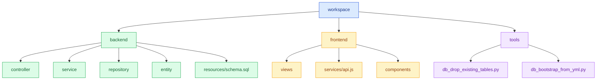
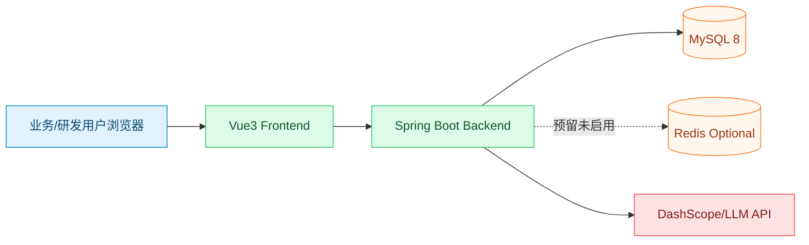
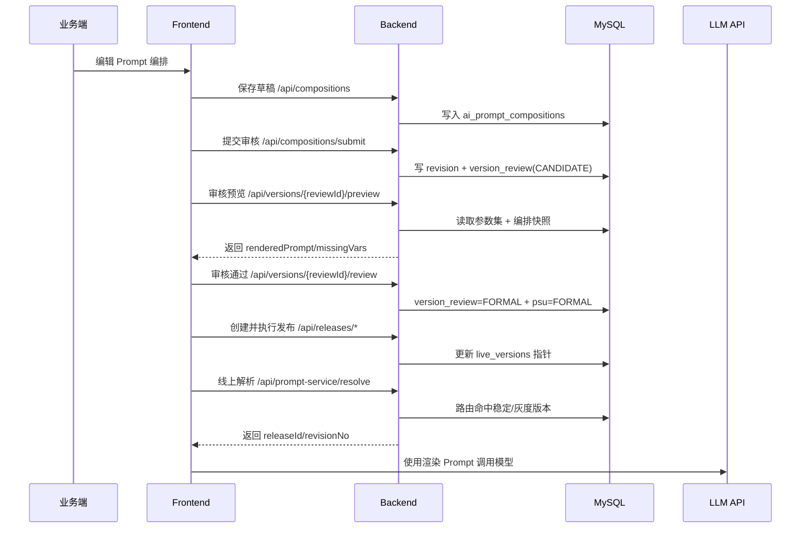

# Prompt Service Platform

> 目标：构建一个面向企业内部的 Prompt 研发平台，覆盖提示词模板研发、服务化发布、版本治理、测试评估与可追溯运营。

## 1. 项目定位

本项目对标 Langfuse 的工程化思路，但当前优先聚焦本地可落地的五个业务模块：

1. 提示词模板编辑与调试  
2. 对外提示词服务（查询、版本管理、灰度发布、版本回滚）  
3. JSON Schema 编辑与测试集准备  
4. 对话结果评估（幻觉、连贯性、相关性等多维度）
5. 代码自动生成（Java/Python 调用模板、Schema 入参组装示例）

当前代码已具备「PSU + Schema + Prompt + 编排 + 提审审核 + 测试集运行 + 代码生成入口」主干能力，但灰度/回滚、评估能力与代码生成落地深度仍不足。

## 2. 当前架构

### 2.1 技术栈

- 后端：Java 17、Spring Boot 3.2、Spring Data JPA、MySQL 8、Redis（预留未启用）、Spring Security、Swagger
- 前端：Vue 3、Element Plus、Pinia、Vue Router、Axios、Vite

### 2.2 工程目录

```text
prompt_service_platform/
├─ workspace/
│  ├─ backend/      # Spring Boot 服务
│  ├─ frontend/     # Vue3 管理台
│  ├─ tools/        # 初始化脚本
│  ├─ start-all.bat
│  ├─ start-backend.bat
│  └─ start-frontend.bat
├─ README.md
└─ LICENSE
```

### 2.3 结构图（代码结构）



### 2.4 部署拓扑图（运行视角）



> 说明：Redis 当前仅为预留依赖与配置，业务代码暂未启用缓存/会话等 Redis 能力。

### 2.5 核心调用时序图（提审-审核-发布-解析）



## 3. 五大模块与完成度

> 说明：以下完成度基于当前仓库代码现状，不按历史文档推断。

| 模块 | 目标 | 当前完成度 | 现状结论 |
| --- | --- | --- | --- |
| 模块1：提示词模板编辑与调试 | 模板编辑、变量注入、渲染调试 | 70% | 已有可用编排页和变量注入校验，测试链路仍有 Mock 化 |
| 模块2：对外提示词服务与版本治理 | 查询、版本、灰度、回滚 | 55% | 已有版本提交/审核/快照框架，且已补齐发布域数据模型骨架；灰度路由执行与回滚服务链路待实现 |
| 模块3：Schema + 测试集 | Schema版本与测试集管理 | 75% | Schema/测试集 CRUD 已有，约束体系与契约校验有待加强 |
| 模块4：Prompt 评估 | 幻觉/连贯性/相关性评估 | 10% | 仅有测试运行记录，不存在独立评估模型、评估任务、评估报告体系 |
| 模块5：代码自动生成 | 为 Java/Python 提供调用代码与数据组装模板 | 40% | 已有审核后生成代码文本能力，但仍以 Java 骨架为主，缺少 Python 产物、Schema 强类型映射与发布绑定 |

## 4. 已实现能力清单（按模块）

### 4.1 模块1：提示词模板编辑与调试（已实现部分）

- 编排草稿管理：`DRAFT -> CANDIDATE -> FORMAL -> ARCHIVED` 生命周期已收敛
- 占位符协议：支持 `{{path}}` 变量提取与注入计划校验
- Schema 字段存在性校验：保存与提交时会对变量路径做检查
- 渲染预览：支持根据输入参数替换变量并返回缺失变量列表
- 前端编排工作台：PSU 选择、Schema 变量面板、测试数据集联动预览

### 4.2 模块2：对外提示词服务与版本治理（已实现部分）

- 版本提审与审核：支持 `submit`、`review`、`CANDIDATE/FORMAL/ARCHIVED`
- 审核快照：支持编排 revision 快照记录
- 驳回分流：支持 `BACK_TO_DEV` 与 `BACK_TO_BIZ`
- 代码生成入口：审核通过后可拉取生成代码文本
- 版本对比与回滚：支持按 `version_no` 对比与内容回滚
- 发布域数据模型骨架：已新增发布单、发布规则、生效版本指针、回滚记录表与后端实体仓储

### 4.3 模块3：Schema + 测试集（已实现部分）

- Schema 覆盖写管理：按 PSU 维护当前生效 Schema（兼容字段保留）
- 参数集覆盖写管理：按 PSU 维护当前参数集，并用于审核预览
- 测试集管理：支持数据集创建、更新、删除、列表查询
- 测试运行记录：保存 run 主记录和 case 明细（输入、渲染结果、耗时）

### 4.4 模块4：Prompt 评估（当前空缺）

- 未发现评估实体、评估任务队列、评估指标定义、评估报告接口
- 未发现针对幻觉/连贯性/相关性的评分协议或模型调用链路

### 4.5 模块5：代码自动生成（已实现部分）

- 已有后端代码生成服务入口：审核通过时可生成并写入 `VersionReview.codeContent`
- 已有获取代码接口：`GET /api/versions/{psuId}/code`
- 已有前端代码生成页面：支持选择 PSU、预览代码、复制与下载
- 已有基础测试覆盖：版本审核服务测试已覆盖审核通过后触发代码生成

## 5. 关键缺口与风险

### 5.1 模块2（版本治理）关键缺口

- 缺少“生产态 Prompt 服务”协议：当前偏后台管理，不是可供业务系统稳定调用的发布服务
- 缺少灰度发布：无流量分配策略（按租户/请求头/比例/标签）
- 缺少回滚执行链路：无“生效版本指针”与原子切换机制
- 版本号策略未闭环：提审与审核存在，但主/次/修订号与发布动作绑定不充分

### 5.2 模块1/3 共性缺口

- 测试运行存在 Mock 输出，尚未形成真实模型响应与可复现实验记录
- 鉴权链路在配置上几乎全放开（`permitAll`），角色边界仍是“页面约束”而非“后端强约束”
- 前后端页面存在重复入口与流程分散，后续易造成需求漂移

### 5.3 模块4 关键缺口

- 缺少评估数据模型（评估维度、评分、解释、证据）
- 缺少离线/在线评估任务调度
- 缺少评估结果与版本/发布策略联动（门禁）

### 5.4 模块5（代码自动生成）关键缺口

- 缺少分语言产物：当前仅返回单段 Java 风格文本，未提供 Python 客户端模板
- 缺少 Schema 到对象映射：仍以注释和 `Object` 占位为主，未生成强类型 DTO/校验器
- 缺少发布绑定：代码生成与发布单/环境生效版本未建立一一对应关系
- 缺少工程化产物：未产出可直接集成的 SDK 包、依赖声明与最小可运行示例
- 缺少版本可追溯元数据：下载文件名固定，未携带 PSU/版本号/语言等关键信息

## 6. 快速开始

### 6.1 环境要求

- Java 17+
- Maven 3.8+
- Node.js 16+
- MySQL 8
- Redis（可选，当前未启用）

### 6.2 启动方式

```bash
cd workspace
start-all.bat
```

或分别启动：

```bash
cd workspace/backend
mvn spring-boot:run
```

```bash
cd workspace/frontend
npm install
npm run dev
```

### 6.3 默认地址

- 前端：`http://localhost:5173`
- 后端：`http://localhost:8084`
- Swagger：`http://localhost:8084/swagger-ui.html`

### 6.4 数据库工具（版本号改单字段后）

- 删除库中已有表：`workspace/tools/db_drop_existing_tables.py`
- 初始化表结构并初始化原始数据：`workspace/tools/db_bootstrap_from_yml.py`

运行前需配置环境变量：

- `PSU_DB_HOST`
- `PSU_DB_PORT`
- `PSU_DB_USER`
- `PSU_DB_PASSWORD`
- `PSU_DB_NAME`

## 7. 近期路线图（建议）

### 里程碑 M1：版本治理可上线（2-3 周）

- 补齐发布服务接口（按 PSU/环境/版本查询）
- 引入“生效版本指针”与回滚 API
- 完成最小灰度策略（固定比例 + 白名单）

### 里程碑 M2：评估体系 MVP（2-4 周）

- 定义评估任务与评分模型
- 支持离线批量评估（基于测试集）
- 输出评估报告并关联版本

### 里程碑 M3：发布门禁与观测（2 周）

- 评估分数阈值门禁（阻止低质量版本发布）
- 关键指标看板（成功率、缺失变量率、平均评分）

### 里程碑 M4：代码生成落地（2-3 周）

- 增加语言参数：支持 Java/Python 双模板生成（按语言返回不同代码）
- 按 Schema 生成结构化输入模型与校验代码（非注释占位）
- 生成代码与发布单绑定（PSU + 环境 + 生效版本），确保“取到的模板版本 = 生成代码版本”
- 提供最小调用样例（resolve 接口调用 + 入参组装 + 错误处理）

## 8. 相关文档

- 需求澄清与完成度评估：`docs/需求澄清与完成度评估.md`
- 模块2发布方案（灰度/回滚）：`docs/模块2-发布灰度回滚-详细方案.md`
- 版本号改造方案（单字段）：`docs/版本号单字段改造方案.md`
- 前端说明：`workspace/frontend/README.md`
