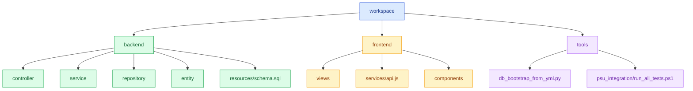
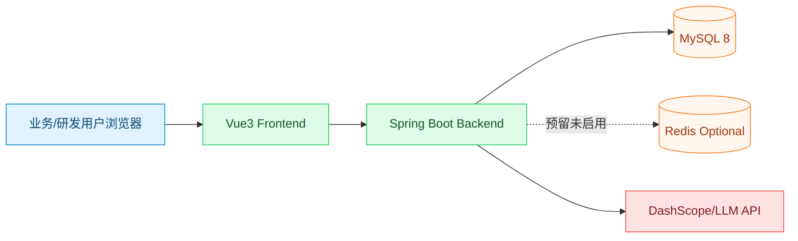
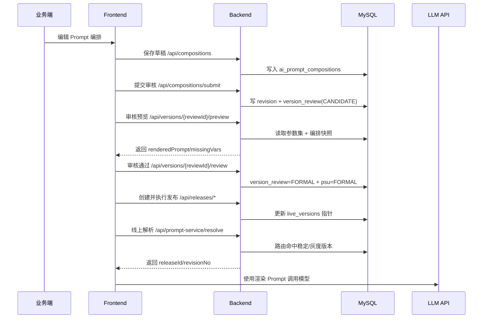
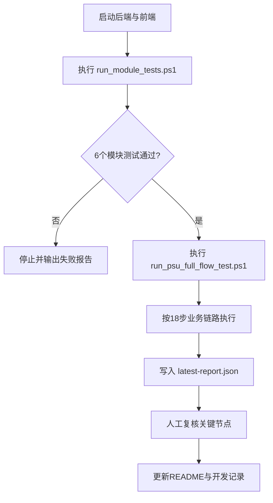
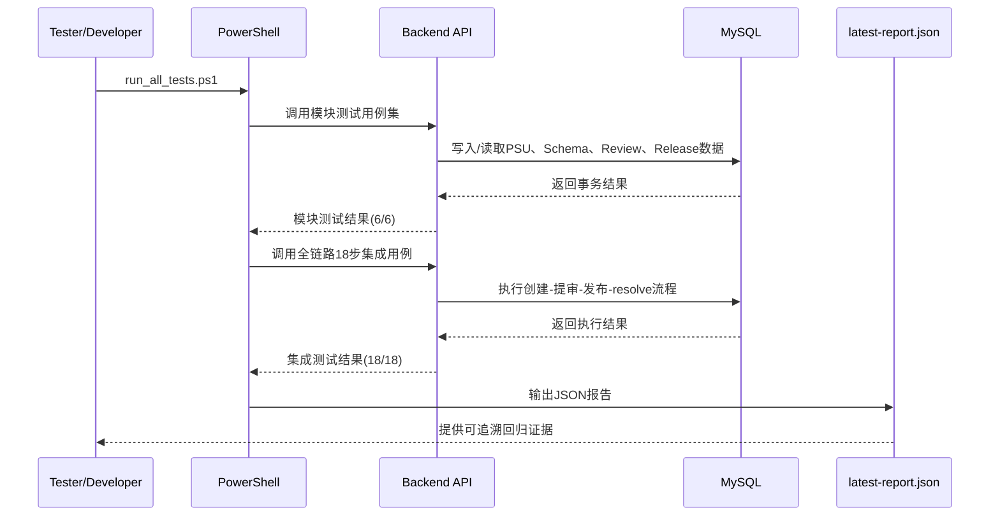
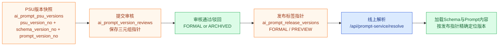
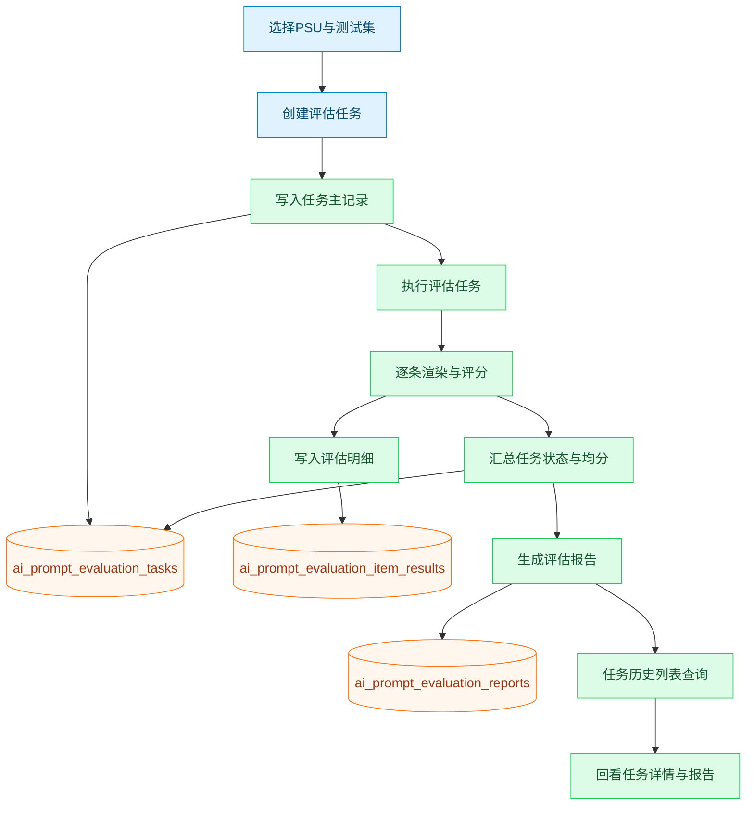
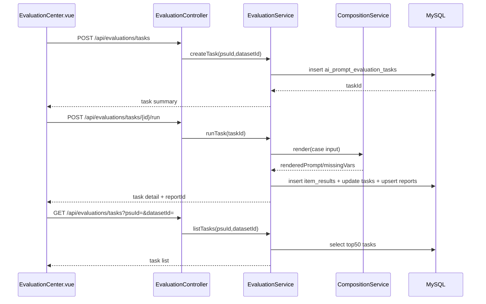
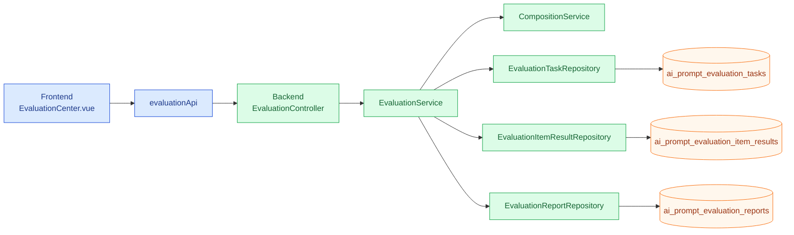

# Prompt Service Platform

**文档版本**：V2.1（文件清单与测试链路同步）  
**版本时间**：2026-05-09

> 目标：构建一个面向企业内部的 Prompt 研发平台，覆盖提示词模板研发、服务化发布、版本治理、测试评估与可追溯运营。

## 1. 项目定位

本项目对标 Langfuse 的工程化思路，但当前优先聚焦本地可落地的五个业务模块：

1. 提示词模板编辑与调试  
2. 对外提示词服务（查询、版本管理、灰度发布、版本回滚）  
3. JSON Schema 编辑与测试集准备  
4. 对话结果评估（幻觉、连贯性、相关性等多维度）
5. 代码自动生成（Java/Python 调用模板、Schema 入参组装示例）

当前代码已具备「PSU + Schema + Prompt + 编排 + 提审审核 + 测试集运行 + 代码生成 + 发布中心 + 线上 resolve 解析」主干能力，但鉴权与权限边界、评估能力与代码生成落地深度仍不足。

## 2. 当前架构

### 2.1 技术栈

- 后端：Java 21、Spring Boot 3.5.x、Spring Data JPA、MySQL 8、Redis（预留未启用）、Spring Security、Swagger
- 前端：Vue 3、Element Plus、Pinia、Vue Router、Axios、Vite

### 2.2 工程目录

```text
prompt_service_platform/
├─ workspace/
│  ├─ backend/      # Spring Boot 服务
│  ├─ frontend/     # Vue3 管理台
│  ├─ tools/        # DB脚本与自动化测试脚本
│  │  └─ psu_integration/      # 模块测试 + 全链路集成测试
│  ├─ nacos_config.txt         # 本地配置中心示例
│  ├─ start-all.bat
│  ├─ start-backend.bat
│  └─ start-frontend.bat
├─ README.md
└─ LICENSE
```

### 2.3 结构图（代码结构）



### 2.4 部署拓扑图（运行视角）



> 说明：Redis 当前仅为预留依赖与配置，业务代码暂未启用缓存/会话等 Redis 能力。

### 2.5 核心调用时序图（提审-审核-发布-解析）



### 2.6 全链路流程图（回归测试）



### 2.7 全链路关键时序图（测试驱动）



## 3. 五大模块与完成度

> 说明：以下完成度基于当前仓库代码现状，不按历史文档推断。

| 模块 | 目标 | 当前完成度 | 现状结论 |
| --- | --- | --- | --- |
| 模块1：提示词模板编辑与调试 | 模板编辑、变量注入、渲染调试 | 78% | 已统一编排页测试入口为后端接口，支持结构化测试结果返回 |
| 模块2：对外提示词服务与版本治理 | 查询、版本、灰度、回滚 | 70% | 已具备发布单、灰度规则、回滚记录与 resolve 路由能力；生产级权限收敛与治理闭环仍待加强 |
| 模块3：Schema + 测试集 | Schema版本与测试集管理 | 86% | 已补齐测试集批量运行链路与Schema版本历史抽屉展示，约束体系仍可继续加强 |
| 模块4：Prompt 评估 | 幻觉/连贯性/相关性评估 | 42% | 已具备评估任务、执行、报告查询与前端评估中心 MVP，评分仍为规则占位 |
| 模块5：代码自动生成 | 为 Java/Python 提供调用代码与数据组装模板 | 52% | 已支持 `language=java/python` 双模板生成与前端语言切换，仍缺 Schema 强类型映射与发布绑定 |

## 4. 已实现能力清单（按模块）

### 4.1 模块1：提示词模板编辑与调试（已实现部分）

- 编排草稿管理：`DRAFT -> CANDIDATE -> FORMAL -> ARCHIVED` 生命周期已收敛
- 占位符协议：支持 `{{path}}` 变量提取与注入计划校验
- Schema 字段存在性校验：保存与提交时会对变量路径做检查
- 渲染预览：支持根据输入参数替换变量并返回缺失变量列表
- 前端编排工作台：PSU 选择、Schema 变量面板、测试数据集联动预览
- Prompt测试统一接口：主编排页测试统一走 `POST /api/prompts/{psuId}/test`，返回结构化测试结果

### 4.2 模块2：对外提示词服务与版本治理（已实现部分）

- 版本提审与审核：支持 `submit`、`review`、`CANDIDATE/FORMAL/ARCHIVED`
- 审核快照：支持编排 revision 快照记录
- 驳回分流：支持 `BACK_TO_DEV` 与 `BACK_TO_BIZ`
- 代码生成入口：审核通过后可拉取生成代码文本
- 版本对比与回滚：支持按 `version_no` 对比与内容回滚
- 发布管理：支持发布单创建、审批、执行、历史查询
- 灰度路由：支持白名单/标签/比例策略并在 `resolve` 链路执行命中
- 生效版本指针：支持稳定版本与灰度版本路由切换，并记录回滚历史
- 可提审版本后端判定：支持 `GET /api/psus/by-psuId/submittable-versions`，由后端统一过滤可提交版本
- 历史版本提审：支持 `POST /api/versions/by-psuId/submit?psuId={id}&versionNo={n}` 显式提交指定版本
- 审核预览增强：`/api/versions/{reviewId}/preview` 已回传参数集快照，前端可直观看到预览输入上下文
- Git台账登记：支持 `POST /api/versions/{reviewId}/git-commit`，并新增 hash 格式校验与前端登记入口

## 4.8 版本模型（2026-05-09 更新）

- `Schema`/`Prompt` 是实际生效内容版本（实体版本）。
- `PSU versionNo` 是业务指针版本：该版本指向一组 `schemaVersionNo + promptVersionNo`。
- 审核记录 `ai_prompt_version_reviews` 保存版本三元组指针：
  - `version_no`（PSU 指针版本）
  - `schema_version_no`
  - `composition_id + composition_revision_no`（Prompt 指针）
- 发布记录 `ai_prompt_release_versions` 保留每个 PSU 的标签指针：
  - `FORMAL` / `PREVIEW` 最多各一条有效指针
  - 每条指针记录绑定 `psu_version_no + json_schema_version_no + prompt_version_no`
- 对外 resolve 生效逻辑以发布指针为准，不以“当前最新草稿”推断。

### 4.8.1 指针流转图（PSU -> 审核 -> 发布 -> Resolve）



### 4.3 模块3：Schema + 测试集（已实现部分）

- Schema 覆盖写管理：按 PSU 维护当前生效 Schema（兼容字段保留）
- 参数集覆盖写管理：按 PSU 维护当前参数集，并用于审核预览
- 测试集管理：支持数据集创建、更新、删除、列表查询
- 测试运行记录：保存 run 主记录和 case 明细（输入、渲染结果、耗时）
- 测试运行历史：支持 `GET /api/test-runs?psuId=&datasetId=` 查询最近运行记录，前端可查看与回看详情
- 测试状态与异常原因：run 与 case 两层均保留 `status` 与 `exceptionReason` 字段，便于定位失败根因
- 实际输出语义统一：测试明细仅保留“实际输出”语义（兼容历史字段 `model_output`）
- Schema版本历史视图：支持 `GET /api/schemas/{psuId}/versions` 返回并在Schema编辑区抽屉展示（含变更日志与更新时间）

## 4.6 近期开发进展（2026-04-29）

- 已完成模块A首批落地：Prompt测试接口结构化返回（`renderedPrompt/missingVars/latencyMs/traceId`）。
- 已完成模块B首批落地：批量测试组件已挂载到编排页，并支持运行历史与详情回看。
- 已完成模块B补充落地：测试运行新增状态与异常原因字段，数据库仅保存不做业务校验，统一由 Java 后端校验。
- 已完成模块C局部落地：审核预览支持参数集快照回传，审核列表支持一键预览跳转。
- 已完成模块D首批落地：Git提交hash前后端链路打通，并增加7-40位十六进制格式校验。
- 已完成模块E首批落地：代码生成支持 Java/Python 双模板、前端语言切换与元数据展示。
- 已完成模块H首批落地：Schema版本历史接口与前端抽屉展示打通。
- 已完成模块G首批落地：后端核心接口支持 `/api` 与 `/api/v1` 双路由，前端支持开关切换前缀。
- 已完成模块F首批落地：评估任务/执行/报告接口与“评估中心”页面已打通。
- 已完成模块F体验补齐：支持从测试集列表一键发起评估任务（自动带参进入评估中心）。
- 已完成模块F任务管理补齐：评估中心支持任务历史列表、按测试集筛选以及历史任务详情/报告回看。

## 4.7 近期开发进展（2026-05-08）

- 已新增模块化自动化测试套件：`workspace/tools/psu_integration/test_module_*.py`，覆盖 PSU、Schema/Param、编排审核、测试运行、评估、发布解析 6 个模块。
- 已新增全链路集成测试编排：`psu_api_case_logic.py` + `psu_api_test_runner.py`，按 18 步业务链路执行。
- 已新增一键执行脚本：`run_module_tests.ps1`、`run_psu_full_flow_test.ps1`、`run_all_tests.ps1`。
- 已沉淀执行报告：`workspace/tools/psu_integration/reports/latest-report.json`，并提供测试执行记录文档 `TEST_EXECUTION_DOC_2026-05-08.md`。
- 本次记录基于 2026-05-08 回归结果：模块测试 `6/6` 通过、全链路测试 `18/18` 通过。

### 4.4 模块4：Prompt 评估（已实现部分）

- 已新增评估主数据模型：`ai_prompt_evaluation_tasks`、`ai_prompt_evaluation_item_results`、`ai_prompt_evaluation_reports`
- 已新增评估接口：`POST /api/evaluations/tasks`、`POST /api/evaluations/tasks/{id}/run`、`GET /api/evaluations/tasks/{id}`、`GET /api/evaluations/reports/{id}`
- 已新增评估历史接口：`GET /api/evaluations/tasks?psuId=&datasetId=`（支持按测试集筛选）
- 已新增评估中心页面：支持选择 PSU/测试集，创建任务、执行任务、查看报告与问题样例
- 已补齐任务管理视图：支持历史任务列表、详情回看与报告快速打开
- 评分策略当前为规则化占位（相关性/完整性/格式符合度），后续可接模型评委

### 4.4.1 模块4可视化（新增）

#### A. 业务流程图（评估任务管理闭环）



#### B. 关键时序图（创建-执行-回看）



#### C. 功能模块拓扑图（评估中心）



### 4.5 模块5：代码自动生成（已实现部分）

- 已有后端代码生成服务入口：审核通过时可生成并写入 `VersionReview.codeContent`
- 已有获取代码接口：`GET /api/versions/{psuId}/code`（支持 `language=java|python`）
- 已有前端代码生成页面：支持选择 PSU、预览代码、复制与下载
- 已有基础测试覆盖：版本审核服务测试已覆盖审核通过后触发代码生成
- 已支持下载文件名规范化：`psu-{id}-{language}-{timestamp}.{ext}`

## 5. 关键缺口与风险

### 5.1 模块2（版本治理）关键缺口

- 发布与解析接口已具备基础能力，但生产级鉴权、边界隔离与审计约束尚未闭环
- 灰度策略已支持白名单/标签/比例命中，但策略治理与可观测能力仍不足
- 回滚链路已落地，仍需补充更严格的原子切换与发布门禁保障
- 版本号策略未闭环：提审与审核存在，但主/次/修订号与发布动作绑定不充分

### 5.2 模块1/3 共性缺口

- 测试运行存在 Mock 输出，尚未形成真实模型响应与可复现实验记录
- 鉴权链路在配置上几乎全放开（`permitAll`），角色边界仍是“页面约束”而非“后端强约束”
- 前后端页面存在重复入口与流程分散，后续易造成需求漂移

### 5.3 模块4 关键缺口

- 评分能力仍为规则占位，缺少模型评委与证据链解释
- 缺少异步任务队列与重试治理（当前为同步执行）
- 缺少评估结果与版本/发布策略联动（门禁）

### 5.4 模块5（代码自动生成）关键缺口

- 分语言产物仍属模板级：虽已支持 Java/Python，但缺少 SDK 级工程化打包
- 缺少 Schema 到对象映射：仍以注释和 `Object` 占位为主，未生成强类型 DTO/校验器
- 缺少发布绑定：代码生成与发布单/环境生效版本未建立一一对应关系
- 缺少工程化产物：未产出可直接集成的 SDK 包、依赖声明与完整最小可运行工程
- 版本追溯元数据仍不充分：虽已规范文件名，但尚未与发布单强绑定

## 6. 快速开始

### 6.1 环境要求

- Java 17+
- Maven 3.8+
- Node.js 16+
- MySQL 8
- Redis（可选，当前未启用）

### 6.2 启动方式

```bash
cd workspace
start-all.bat
```

或分别启动：

```bash
cd workspace/backend
mvn spring-boot:run
```

```bash
cd workspace/frontend
npm install
npm run dev
```

前端 API 前缀切换（模块G）：
- 默认：`/api`（兼容旧路径）
- 切换到 `/api/v1`：设置环境变量 `VITE_API_USE_V1=true`
- 显式指定 API 基址（优先级更高）：设置 `VITE_API_BASE_URL`，例如 `https://your-domain.example.com/api`
- 子路径部署（如 `http://ip/psu/`）：设置 `VITE_PUBLIC_BASE=/psu/` 且建议 `VITE_API_BASE_URL=/psu-api`

### 6.3 默认地址

- 前端：`http://localhost:5173`
- 后端：`http://localhost:8084`
- Swagger：`http://localhost:8084/swagger-ui.html`

### 6.4 数据库工具（版本号改单字段后）

- 删除库中已有表：`workspace/tools/db_drop_existing_tables.py`
- 初始化数据库表结构（读取 `application.yml`）：`workspace/tools/db_bootstrap_from_yml.py`

运行前需配置环境变量：

- `PSU_DB_HOST`
- `PSU_DB_PORT`
- `PSU_DB_USER`
- `PSU_DB_PASSWORD`
- `PSU_DB_NAME`

### 6.5 自动化回归测试（新增）

```powershell
powershell -ExecutionPolicy Bypass -File workspace\tools\psu_integration\run_all_tests.ps1 -BaseUrl "http://127.0.0.1:8084" -ApiPrefix "/api"
```

- 模块测试脚本：`workspace/tools/psu_integration/test_module_*.py`
- 全链路测试报告：`workspace/tools/psu_integration/reports/latest-report.json`

## 7. 近期路线图（建议）

### 里程碑 M1：版本治理可上线（2-3 周）

- 补齐发布服务接口（按 PSU/环境/版本查询）
- 引入“生效版本指针”与回滚 API
- 完成最小灰度策略（固定比例 + 白名单）

### 里程碑 M2：评估体系 MVP（2-4 周）

- 定义评估任务与评分模型
- 支持离线批量评估（基于测试集）
- 输出评估报告并关联版本

### 里程碑 M3：发布门禁与观测（2 周）

- 评估分数阈值门禁（阻止低质量版本发布）
- 关键指标看板（成功率、缺失变量率、平均评分）

### 里程碑 M4：代码生成落地（2-3 周）

- 增加语言参数：支持 Java/Python 双模板生成（按语言返回不同代码）
- 按 Schema 生成结构化输入模型与校验代码（非注释占位）
- 生成代码与发布单绑定（PSU + 环境 + 生效版本），确保“取到的模板版本 = 生成代码版本”
- 提供最小调用样例（resolve 接口调用 + 入参组装 + 错误处理）

## 8. 相关文档

- 需求澄清与完成度评估：`docs/需求澄清与完成度评估.md`
- 模块2发布方案（灰度/回滚）：`docs/模块2-发布灰度回滚-详细方案.md`
- 版本号改造方案（单字段）：`docs/版本号单字段改造方案.md`
- 前端说明：`workspace/frontend/README.md`
- 同机部署指南（Nginx + 前后端同服务器）：`example/deploy/README.md`

## 9. 数据库约定（新增）

### 9.1 命名与字段约定

- 表命名统一前缀：`ai_prompt_`。
- 主键统一：`id BIGINT AUTO_INCREMENT`。
- 时间字段统一：`created_at`、`updated_at`，默认 `CURRENT_TIMESTAMP`。
- 用户追踪字段统一：`created_by`、`updated_by`、`modified_by`、`operator_id`（按业务场景使用）。
- 状态字段分层：编排/审核/发布使用明确 `ENUM`；测试与评估状态使用 `VARCHAR(32)`，由后端做状态合法性校验。

### 9.2 一致性约定

- 多版本语义：`ai_prompt_json_schemas` 使用 `(psu_id, version)` 唯一约束，保留历史版本。
- PSU版本历史：`ai_prompt_psu_versions` 使用 `(psu_id, version_no)` 唯一约束，记录每次版本快照及 schema/prompt 指针。
- 参数集语义：`ai_prompt_param_sets` 仍为覆盖写（按 `psu_id` 唯一）。
- 编排唯一性：`ai_prompt_compositions` 对 `psu_id` 唯一，快照表 `ai_prompt_composition_revisions` 对 `(composition_id, revision_no)` 唯一。
- 版本唯一性：`ai_prompt_version_reviews` 对 `(psu_id, version_no)` 唯一。
- 生效指针唯一性：`ai_prompt_live_versions` 对 `(psu_id, environment)` 唯一。
- 报告唯一性：`ai_prompt_evaluation_reports` 对 `task_id` 唯一。

### 9.3 业务域分表约定

- 主数据域：`ai_prompt_psu`、`ai_prompt_users`、`ai_prompt_system_configs`。
- 研发编排域：`ai_prompt_compositions`、`ai_prompt_composition_revisions`、`ai_prompt_prompt_fragments`、`ai_prompt_version_reviews`。
- 测试评估域：`ai_prompt_test_datasets`、`ai_prompt_test_runs`、`ai_prompt_test_run_items`、`ai_prompt_evaluation_tasks`、`ai_prompt_evaluation_item_results`、`ai_prompt_evaluation_reports`。
- 发布治理域：`ai_prompt_releases`、`ai_prompt_release_rules`、`ai_prompt_live_versions`、`ai_prompt_rollbacks`、`ai_prompt_release_versions`。
- 审计域：`ai_prompt_audit_logs`。
